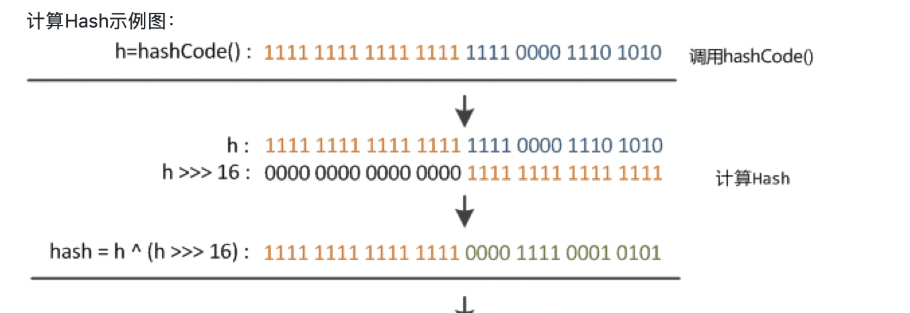

# JDK多线程和集合

## HashMap的底层实现

### JDK1.7和JDK1.8中的区别

  底层结构： jdk1.7中由数组+链表实现；在jdk1.8中由数组+链表+红黑树实现，以数组+链表的结构为例。

  HashMap是基于哈希表的Map接口实现的，是以key-value存储形式存在，主要来放键值对，HashMap的实现不是同步的，所以它不是线程安全的，它的key、value都可以为null。此外，HashMap中的映射不是有序的。jdk1.8之前HashMap由数组+链表组成的，数组是HashMap的主体，链表则是为了解决哈希冲突（两个对象调用的hashCode方法计算的哈希值一样导致计算的数组索引相同）而存在的，1.8之后由数组+链表+红黑树实现，当链表长度大于红黑树的边界值8时，并且当前数组的长度大于64时，此时索引位置上的所有数据改为红黑树。

#### 为什么链表要改为红黑树

当冲突过多的时候，链表查询的时间复杂度是O(N)，红黑树的查询时间复杂度O(logN)。

##### 什么时候转换成红黑树

> 自己补充

#### 初始化因子过小会导致什么，过大会导致什么

初始化加载因子 Loadfactor = 0.75，因为扩容机制，过大导致发生冲突的概率比较大，过小导致空间浪费。

#### Hash值计算的方式

JDK 1.8 ：（h = key.hashcode（）） ^ (h >>> 16)



JDK 1.7:  **自己百度，补充。**

## HashMap为什么不是线程安全的

没有使用synchronized或lock

## 怎么样使HashMap是线程安全的

1. Collections.synchronizedMap()
2. ConcurrentHashMap

### 2种方式有什么区别

> 自己补充

/**
         * HashMap底层源码
                  * 1.执行构造器 new HashMap（）{}
                  * 初始化加载因子 Loadfactor = 0.75
                           * HashMap$Node[] table = null
                               *
                               * 2.执行put 调用 hash方法，计算k的hash值（h = key.hashcode（）） ^ (h >>> 16)
                                    *  b.如果底层是table，数组为null，或length＝0，就扩容到16；
                                    *  c.取出hash值对应的table的索引位置的Node，如果为null，就直接把加入的k-v创建成一个Node，加入该位置即可
                                             *  d.如果table位置索引的key的hash值和新的key的hash值想同，并满足（table现有的节点的key和准备添加的key是同一个对象 ||equals返回真）
                                                 *    就认为不能加入新的k-v
                                                      *  e.如果当前的table已有node，是红黑树，就按照红黑树的方式处理
                                                               *  f.如果找到的以有的节点，后面是链表，就循环的比较
                                                                   *  g.如果整个链表，没有和他相同，就加到链表最后
                                                                        *  h.加入后，判断当前链表的个数，是否已经到8个，到8个后，就调用treeifyBin方法进行红黑树的转换
                                                                            *  i.如果在比较过程中，发现有相同的，就break，就只是替换value
                                                                                 *  j.每增加一个node，就size++；
                                                                                 *  k.如果size>临界值，就扩容
                                                                                          *  l.关于树化（转成红黑树）
                                                                                              *  如果table为null，或者大小没有达到64，则暂时不进行树化，而是进行扩容
                                                                                                   *  否则才会真正树化
                                                                                                   *
                                                                                                   */

# Redis 

## 五大数据类型及使用场景

String : 对应Java的String，用于字符串

List： 对应Java的LinkedList（双向链表），用于有序的，可重复的集合

> 跟踪源码看一下Node的实现。
>
> Include non-project items 单词本，记单词

Set： 对应Java的HashSet，用无序的，不可重复的集合

Hash：对应Java的HashMap，用于存储实体类的

Zset： 用于排序的

## 详细使用场景

> 后续补充

## 为什么使用Redis以及Redis为什么这么快

1. 因为他访问速度快，因为他完全基于内存，绝大部分请求是纯粹的内存操作，非常快速，数据存储在内存中
2. 用C语言实现，C语言效率比较高。
3. Redis是单线程运行的，不用切换上下文环境。

## 切换上下文是什么意思

> 自己补充

# 数据库MySQL

## 常用增删改查语句

>  要能在编辑器写出来，用Mybatis-plus写的不算。

```sql
## ```sql 出来就能写对应的语言了。
SELECT a,b,c 
FROM table1
WHERE id > 1
GROUP BY 
ORDER BY 
```

SQL场景题：https://leetcode.cn/study-plan/sql/?progress=3kq6h2c，在网页中写，直接执行即可。

>  白板写SQL，把关键字都记住。


## inner join、left join、right join的区别


## 事务

事务的四大特性；事务的隔离级别。

事务的四大特性：原子性，一致性，隔离性，持久性

事务的隔离级别：读未提交， 读已提交，可重复度，串行化

## 索引及Explain关键字的使用

> 抽个周末讲讲
>
> 

# JVM	

## *内存结构*

（1）方法区：存储已**被虚拟机加载的类元数据信息**(元空间)

（2）堆：**存放对象实例**，几乎所有的对象实例都在这里分配内存

（3）虚拟机栈：虚拟机栈描述的是**Java方法执行的内存模型**：每个方法被执行的时候都会同时创建一个**栈帧**（Stack Frame）用于存储局部变量表、操作栈、动态链接、方法出口等信息

（4）程序计数器：当前线程所执行的字节码的**行号指示器**

（5）本地方法栈：本地方法栈则是为虚拟机使用到的**Native方法服务**。

https://note.youdao.com/s/M4mragg8 周末讲


## 类加载器ClassLoader

  负责加载class文件，class文件在文件开头有特定的文件标示，并且ClassLoader只负责class文件的加载，至于它是否可以运行，则由Execution Engine决定。

类加载器分为四种：前三种为虚拟机自带的加载器。

- 启动类加载器（Bootstrap）C++

  负责加载$JAVA_HOME中jre/lib/**rt.jar**里所有的class，由C++实现，不是ClassLoader子类

- 扩展类加载器（Extension）Java

  负责加载java平台中**扩展功能**的一些jar包，包括$JAVA_HOME中jre/lib/*.jar或-Djava.ext.dirs指定目录下的jar包

- 应用类加载器（AppClassLoader）Java

  也叫系统类加载器，负责加载**classpath**中指定的jar包及目录中class

- 用户自定义加载器  Java.lang.ClassLoader的子类，用户可以定制类的加载方式

### 类加载器的双亲委派机制：

- 1、当AppClassLoader加载一个class时，它首先不会自己去尝试加载这个类，而是把类加载请求委派给父类加载器ExtClassLoader去完成。
- 2、当ExtClassLoader加载一个class时，它首先也不会自己去尝试加载这个类，而是把类加载请求委派给BootStrapClassLoader去完成。
- 3、如果BootStrapClassLoader加载失败（例如在$JAVA_HOME/jre/lib里未查找到该class），会使用ExtClassLoader来尝试加载；
- 4、若ExtClassLoader也加载失败，则会使用AppClassLoader来加载
- 5、如果AppClassLoader也加载失败，则会报出异常ClassNotFoundException

​    其实这就是所谓的**双亲委派模型**。简单来说：如果一个类加载器收到了类加载的请求，它首先不会自己去尝试加载这个类，而是把**请求委托给父加载器去完成，依次向上**。 

好处：**防止内存中出现多份同样的字节码**(安全性角度)


## GC算法和调优

https://note.youdao.com/s/GLy5QRjZ 后面讲

- 复制算法(Copying)
- 标记清除(Mark-Sweep)
- 标记压缩(Mark-Compact)，又称标记整理
- 分代收集算法(Generational-Collection)


- 次数上频繁收集Young区
- 次数上较少收集Old区
- 基本不动Perm区

## 堆体系概述

**Heap 堆**：一个JVM实例只存在一个堆内存，堆内存的大小是可以调节的。类加载器读取了类文件后，需要把类、方法、常变量放到堆内存中，保存所有引用类型的真实信息，以方便执行器执行，堆内存逻辑上分为三部分：

- Young Generation Space  新生区                    Young/New
- Tenure generation space  养老区                    Old/Tenure
- Permanent Space               永久区                    Perm
- 也称为：新生代（年轻代）、老年代、永久代（持久代）


# linux命令

第17章Linux命令，11节。 全部记住。**在虚拟机敲，熟练使用。**

## Redis命令集

http://redis.cn/commands.html，对照着在命令行把常用的String、Hash、List、SortedSet、Set。

# spring-boot和cloud，mybatis-plus，nacos 熔断 降级 网关 分布式事务

## 缓存击穿

​	概念：查询数据的时候，某个热点key 失效了 。如果此时出现并发，则会冲击数据库！ 可能会导致数据库宕！

解决方案： 加锁

1.	redis 原生的分布式锁
2.	redisson 框架实现分布式锁


## 缓存穿透

​	概念：查询数据的时候，这个数据在缓存中不存在，同时**这个数据在数据库中也不存在**！ 在缓存中没有做任何数据存储，则此时会造成对数据库的冲击！可能会导致数据库宕机

解决方案：

```java
// 数据库中有skuId = 24
if(true){ // 缓存中有数据
    //	直接返回即可！
    return getRedis(skuId);
}else{
    //	缓存中没有数据，直接查询数据,并将数据放入缓存！
    SkuInfo skuInfo = getDB(skuId);
    if(skuInfo!=null){
        //	将数据库中的数据放入缓存. skuInfo 有效数据
        setRedis(key,skuInfo);
    }else{
        //	存储一个空值进去
        setRedis(key,new SkuInfo());
    }
}
/*
	example 1:
		查询 skuId = 124 , 这个skuId 我的数据库中不存在！ 
		第一次查询数据的时候  http://item.gmall.com/124.html  ，数据库没有 skuInfo == null, 不会将数据放入缓存！  如果1002万并发同时访问 skuId = 124; 则此时会造成对数据库的冲击！可能会导致数据库宕机！
	如果使用了第一种解决方案：
		第一次查询的时候： http://item.gmall.com/124.html  数据库没有 skuInfo == null ，此时会存储一个new SkuInfo(); 
		第二次查询的时候： http://item.gmall.com/124.html  此时缓存中有数据，但是缓存中对象的属性值都是null;
		这个 null 值，设置一个过期时间，不能永远都存在！
	第一种解决方案：
		缓存一个空值进去！
	example 2: 
	随机穿透：类似于 uuid.html  124.html 125.html 126.html ...... ,对于这种随机穿透 缓存null 值没有任何意义！ 在缓存中存储大量的 null 值！
	
第二种解决方案：使用布隆过滤器解决
	在查询数据的时候，先去查询 布隆过滤器中是否存在这个 skuId ，如果存在，则放行，不存在则直接拦截！
	*/
```

## 缓存雪崩

​	概念：查询数据的时候，此时缓存中的**所有key 全部失效**！ 此时出现了并发，则会对数据库造成冲击，导致数据库宕机！

​	解决方案：

		1.	设置缓存的key 的时候，在基础的过期时间上 + 随机值
		2.	将单节点改为集群


### 分布式锁解决方案

#### 使用数据库方式

mysql InnoDB 存储引擎 支持行锁！ 但是，性能太低了。同一时刻只能有一个线程操作， 产生Io

select id from sku_info where id = 10 for update; 


#### 使用Zookeeper 方式

充当 注册中心，树形目录结构 。利用Zookeeper 的节点特性，来控制锁！ 产生Io

使用分布式锁：应该使用Zookeeper 的 临时节点创建 ：来防止死锁！

create -s -e /t v   s:表示顺序  e:表示临时

节点特性不能重复  临时节点 、持久化节点 

create -e /t1 v1;     提示 ：t1 created

create -e /t1 v1;     提示：t1  already   

安全性好：


#### 使用redis 方式

​	基于内存存储数据

​	setnx:	表示key 不存在的时候生效

​	setex:	表示给key设置一个过期时间

​	性能高：

**电商中推荐使用：redis 做分布式锁！**

Aop+分布式锁

利用面向切面编程的思想： 在不改变原有业务基础之上 添加新的功能！ 参考@Transactional注解 aop思想！


#### ***高级方式解决缓存穿透---布隆过滤器***

布隆过滤器：底层就是一个二进制向量，查找一个数据在集合中是否存在！底层存储数据要么是0，要么是1

默认是0！ 0：表示元素不存在， 1：表示元素存在


如何将数据保存到布隆过滤器中：

​    通过k个函数进行出hash值，然后将hash值对应的数组下标的数据从0-1！


布隆过滤器使用场景： 判断一个元素是否在一个集合中。解决缓存穿透问题！


如何将数据保存到布隆过滤器中：

​	通过k个函数计算出hash值，然后将hash值对应的数组下标的数据 从 0 -1 !

如何从布隆过滤器中查找数据：

​	通过k个函数计算出hash值，找到hash值对应的数组下标，如果都是1 则表明 数据存在！只要有一个是0 则表明数据不存在！


优点：

​	底层是二进制数组，占用空间小

​	它的插入和查询速度是非常快的，时间复杂度是O（K），空间复杂度：O (M)。

​		K: 是哈希函数的个数

​		M: 是二进制位的个数

​    保密性好，存储的不是真正数据，而是用0或1 的组合表示！

缺点：

​	通过k个hash 函数计算时，可能会出现hash 碰撞，此时数据不太准确了。就会出现误判！

​	删除困难： 如果hash函数，出现了hash 碰撞，则删除数据时，可能存在误删！


